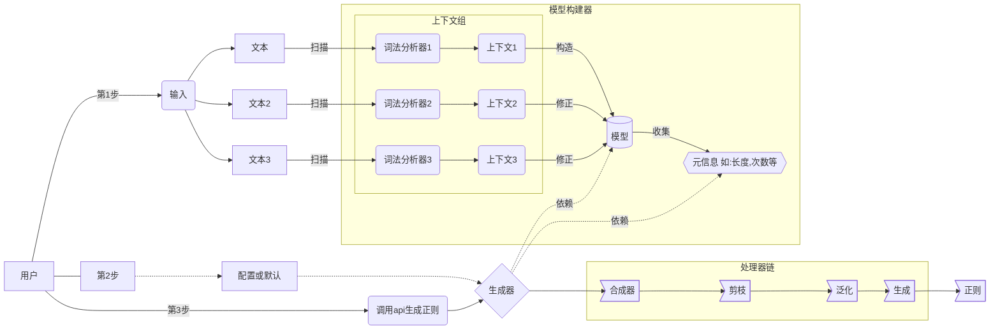

# regex-generator

## 说明

**regex-generator**是一个用于生成自动生成正则表达式的引擎库(regex generator engine).

它的功能是通过多次扫描结构相同或相似文本，提取其结构，构造出**模型**(节点树)并收集相关信息，多次扫描可以更加完善模型，收集更多的信息

## 架构

通过**文本**构造**模型**, 生成器会根据**模型**生成**正则**

## 待办列表

#### 文本解析(模型构建)

- [x] 基本解析

- [ ] 支持更多常见结构，如：URI

- [ ] 支持常用中文PAIR

#### 模型修正(合并)

- [x] 基本修正

- [ ] 支持更多节点，如Id

- [x] 信息收集

#### 正则生成

- [x] 基本生成

- [x] 节点复制

- [ ] 后缀提取

- [x] 节点剪枝

- [x] 节点泛化
