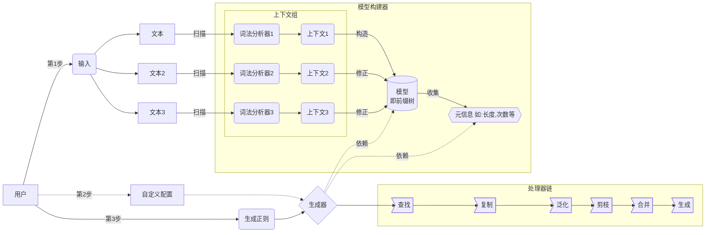

# regex-generator

## 说明

**regex-generator**是一个用于生成自动生成正则表达式的引擎库(regex generator engine).

它的功能是通过多次扫描结构相同或相似文本，提取其结构，构造出**模型**(节点树)并收集相关信息，多次扫描可以更加完善模型，收集更多的信息

## 架构

通过**文本**构造**模型**, 生成器会根据**模型**生成**正则**



## 待办列表

#### 文本解析(模型构建)

- [x] 基本解析

- [ ] 支持更多常见结构，如：URI

- [ ] 支持常用中文PAIR

#### 模型修正(合并)

- [x] 基本修正

- [ ] 支持更多节点，如Id

- [x] 信息收集

#### 正则生成

- [x] 基本生成

- [x] 节点复制

- [ ] 后缀提取

- [x] 节点剪枝

- [x] 节点泛化

#### 重点任务
- [ ] 重构、细化模式级别
- [ ] 支持更多结构
- [ ] 提升泛化能力及准确性
- [ ] bug修复
- [ ] 可视化,开发regex-generator-web项目

## 使用案例

文本

```txt
pheker java 78
pheker english 55
pheker english 55
pheker golang 88
pheker golang 88
pheker golang 88
pheker golang 88
zj java 15
zj php 95
93 zj js
```

构建模型及正则生成

```java
@Slf4j
@RunWith(JUnit4.class)
public class GeneralizerTest {
    private String text = "<Your Test Text>";
    @Test
    public void testGeneralizer() {
        final Model model = ModelBuilder.of(text).build();
        log.info("model: {}", model.format());
        
        Generator gen = Generator.of(model);
        log.info("gen: {}", gen.generate());
    }
}
```

日志

```log
11:28:27.723 [main] INFO cn.pheker.regex.generator.test.GeneralizerTest - model: 
=================================== 模型 ===================================
Branches{    MetaInfo{[(16,9),(17,9),(8,1),(9,9),(10,9),(12,9),(13,9),(14,9)]}
    Sequence{    MetaInfo{[(16,9),(17,9),(9,9),(10,9),(12,9),(13,9),(14,9)]}
        Id{    MetaInfo{[(2,2),(6,7)]}
            Branches{    MetaInfo{[(6,7),(2,2)]}
                Sequence{    MetaInfo{[(6,7)]}
                    Single  (Lower, "p")  MetaInfo{[(1,7)]}
                    Single  (Lower, "h")  MetaInfo{[(1,7)]}
                    Single  (Lower, "e")  MetaInfo{[(1,7)]}
                    Single  (Lower, "k")  MetaInfo{[(1,7)]}
                    Single  (Lower, "e")  MetaInfo{[(1,7)]}
                    Single  (Lower, "r")  MetaInfo{[(1,7)]}
                }
                Sequence{    MetaInfo{[(2,2)]}
                    Single  (Lower, "z")  MetaInfo{[(1,2)]}
                    Single  (Lower, "j")  MetaInfo{[(1,2)]}
                }
            }
        }
        Single  (SPACE, " ")  MetaInfo{[(1,9)]}
        Id{    MetaInfo{[(3,1),(4,2),(6,4),(7,2)]}
            Branches{    MetaInfo{[(3,1),(4,2),(6,4),(7,2)]}
                Sequence{    MetaInfo{[(4,2)]}
                    Single  (Lower, "j")  MetaInfo{[(1,2)]}
                    Single  (Lower, "a")  MetaInfo{[(1,2)]}
                    Single  (Lower, "v")  MetaInfo{[(1,2)]}
                    Single  (Lower, "a")  MetaInfo{[(1,2)]}
                }
                Sequence{    MetaInfo{[(7,2)]}
                    Single  (Lower, "e")  MetaInfo{[(1,2)]}
                    Single  (Lower, "n")  MetaInfo{[(1,2)]}
                    Single  (Lower, "g")  MetaInfo{[(1,2)]}
                    Single  (Lower, "l")  MetaInfo{[(1,2)]}
                    Single  (Lower, "i")  MetaInfo{[(1,2)]}
                    Single  (Lower, "s")  MetaInfo{[(1,2)]}
                    Single  (Lower, "h")  MetaInfo{[(1,2)]}
                }
                Sequence{    MetaInfo{[(6,4)]}
                    Single  (Lower, "g")  MetaInfo{[(1,4)]}
                    Single  (Lower, "o")  MetaInfo{[(1,4)]}
                    Single  (Lower, "l")  MetaInfo{[(1,4)]}
                    Single  (Lower, "a")  MetaInfo{[(1,4)]}
                    Single  (Lower, "n")  MetaInfo{[(1,4)]}
                    Single  (Lower, "g")  MetaInfo{[(1,4)]}
                }
                Sequence{    MetaInfo{[(3,1)]}
                    Single  (Lower, "p")  MetaInfo{[(1,1)]}
                    Single  (Lower, "h")  MetaInfo{[(1,1)]}
                    Single  (Lower, "p")  MetaInfo{[(1,1)]}
                }
            }
        }
        Single  (SPACE, " ")  MetaInfo{[(1,9)]}
        Numbers{    MetaInfo{[(2,9)]}
            Branches{    MetaInfo{[(2,9)]}
                Sequence{    MetaInfo{[(2,1)]}
                    Single  (DIGIT, "7")  MetaInfo{[(1,1)]}
                    Single  (DIGIT, "8")  MetaInfo{[(1,1)]}
                }
                Sequence{    MetaInfo{[(2,2)]}
                    Single  (DIGIT, "5")  MetaInfo{[(1,2)]}
                    Single  (DIGIT, "5")  MetaInfo{[(1,2)]}
                }
                Sequence{    MetaInfo{[(2,4)]}
                    Single  (DIGIT, "8")  MetaInfo{[(1,4)]}
                    Single  (DIGIT, "8")  MetaInfo{[(1,4)]}
                }
                Sequence{    MetaInfo{[(2,1)]}
                    Single  (DIGIT, "1")  MetaInfo{[(1,1)]}
                    Single  (DIGIT, "5")  MetaInfo{[(1,1)]}
                }
                Sequence{    MetaInfo{[(2,1)]}
                    Single  (DIGIT, "9")  MetaInfo{[(1,1)]}
                    Single  (DIGIT, "5")  MetaInfo{[(1,1)]}
                }
            }
        }
    }
    Sequence{    MetaInfo{[(8,1)]}
        Numbers{    MetaInfo{[(2,1)]}
            Single  (DIGIT, "9")  MetaInfo{[(1,1)]}
            Single  (DIGIT, "3")  MetaInfo{[(1,1)]}
        }
        Single  (SPACE, " ")  MetaInfo{[(1,1)]}
        Id{    MetaInfo{[(2,1)]}
            Single  (Lower, "z")  MetaInfo{[(1,1)]}
            Single  (Lower, "j")  MetaInfo{[(1,1)]}
        }
        Single  (SPACE, " ")  MetaInfo{[(1,1)]}
        Id{    MetaInfo{[(2,1)]}
            Single  (Lower, "j")  MetaInfo{[(1,1)]}
            Single  (Lower, "s")  MetaInfo{[(1,1)]}
        }
    }
}
============================================================================
11:28:27.786 [main] INFO cn.pheker.regex.generator.core.parser.Generalizer - prune-wrapper: Wrapper{node=Sequence{[Sequence{[(DIGIT, "9"), (DIGIT, "3")]}, (SPACE, " "), Sequence{[(Lower, "z"), (Lower, "j")]}, (SPACE, " "), Sequence{[(Lower, "j"), (Lower, "s")]}]},item=Item{level=LEVEL_0, regex=null, lens=(8,8), times=(1,1)}}

11:28:27.786 [main] INFO cn.pheker.regex.generator.test.GeneralizerTest - gen: [(?:pheker|zj) (?:java|english|golang|php) \d{2}]
```

从日志中我们看到一些信息，如下：

1. 模型信息，即从文本构建成的**前缀节点树**

2. 剪枝，没有达到**容错率**的分支会被剪掉

3. 生成的正则，如下：
    ```regexp
    (?:pheker|zj) (?:java|english|golang|php) \d{2}
    ```
