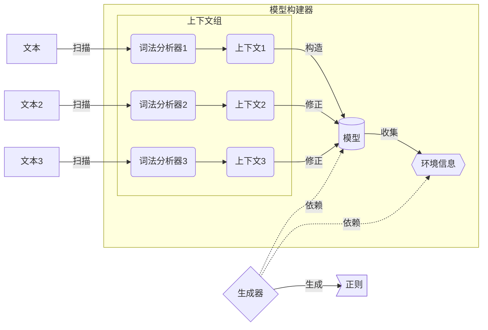

```
# regex-generator
```

regex generator engine
正则生成器引擎

## 架构

通过`文本`构造`模型`, 模型生成`正则`


```mermaid
graph LR
    T1[文本]--扫描-->L1(词法分析器1)
    T2[文本2]--扫描-->L2(词法分析器2)
    T3[文本3]--扫描-->L3(词法分析器3)


    subgraph 模型构建器
        subgraph 上下文组
        L1-->C1(上下文1)
        L2-->C2(上下文2)
        L3-->C3(上下文3)
        end

        model[(模型)]    
        C1--构造-->model
        C2--修正-->model
        C3--修正-->model

        model--收集-->profile{{环境信息}}

    end

    G{生成器}-.依赖.->model
    G-.依赖.->profile
    G--生成-->regex>正则]
```