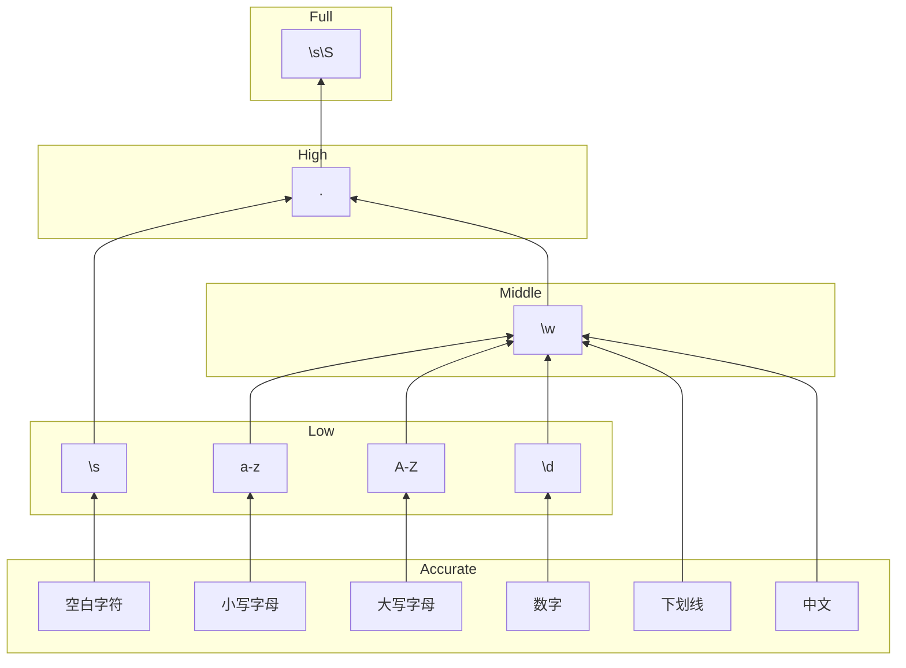

# 正则字符分级

```mermaid
graph BT
    subgraph Full
        direction LR
        all["\s\S"]
    end
    dot-->all

    subgraph High
        direction LR
        dot["."]
    end
    blank1-->dot
    word-->dot

    subgraph Middle
        direction LR
        word["\w"]
    end
    lower1--> word
    upper1--> word
    digit1--> word
    underscore--> word
    chinese--> word

    subgraph Low
        direction LR
        blank1["\s"]
        lower1["a-z"]
        upper1["A-Z"]
        digit1["\d"]
    end
    blank--> blank1
    lower--> lower1
    upper--> upper1
    digit--> digit1

   subgraph Accurate
    direction LR        
    blank[空白字符]
    lower[小写字母]
    upper[大写字母]
    digit[数字]
    underscore[下划线]
    chinese[中文]
   end
```
